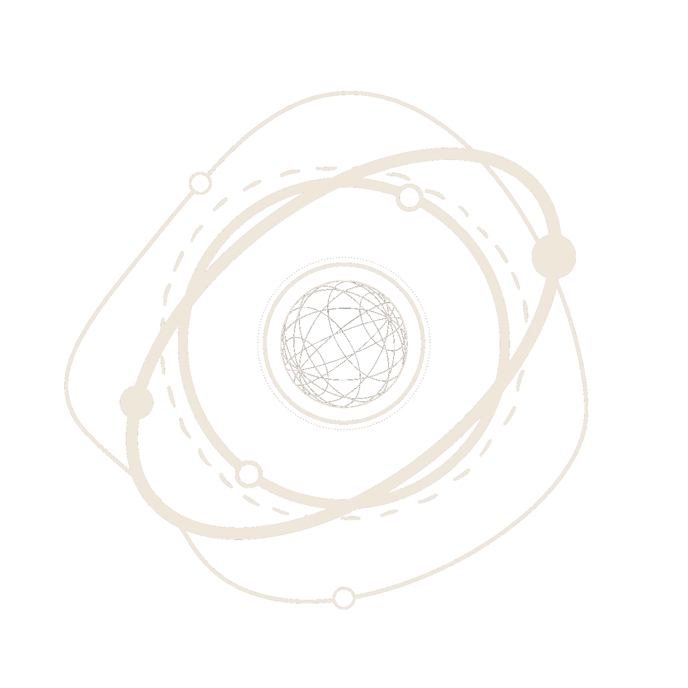
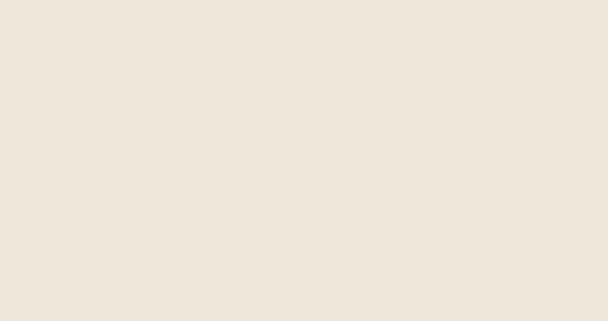

<div align="center">
  
  <h1>Personal Portfolio - V1</h1>

[www.nacu.me](https://nacu.me/)

</div>

## Highlights



<div align="justify">

## Stack

- [Next.js](https://nextjs.org/) - A React framework with hybrid static & server rendering, and route pre-fetching, etc.
- [Chakra UI](https://chakra-ui.com/) - A simple, modular and accessible component library for React
- [Three.js](https://threejs.org/) - 3D library for JavaScript

## Project structure

```
$PROJECT_ROOT
│   # Page files
├── pages
│   # React component files
├── components
│   # Non-react modules
├── lib
│   # Static files for images and 3D model file
└── public
```

## Roadmap

- [x] Basic structure - landpage, bio, experience, and projects
- [x] Mobile responsiveness
- [x] Light and dark mode
- [x] Create landscape gif for README document

## License

MIT

## Attributions

- [Craftzdog](https://github.com/craftzdog/craftzdog-homepage)
- [Gazi](https://github.com/gazijarin/Gazi)

</div>
